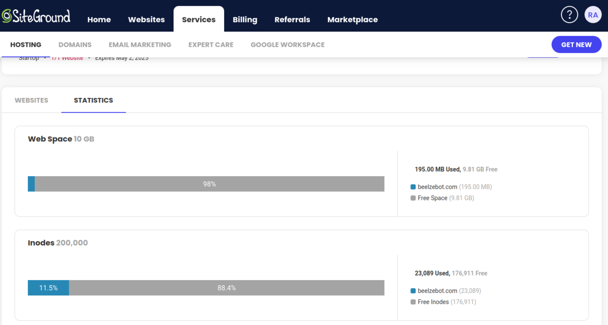
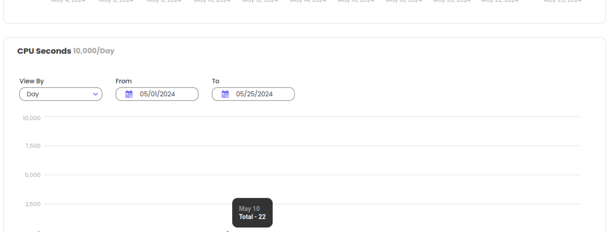
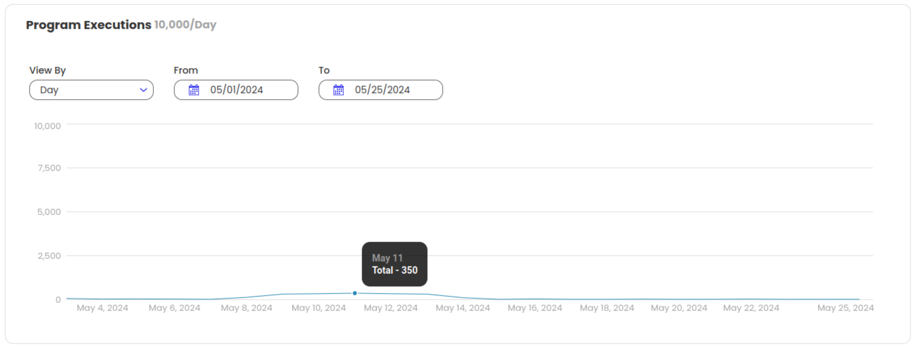
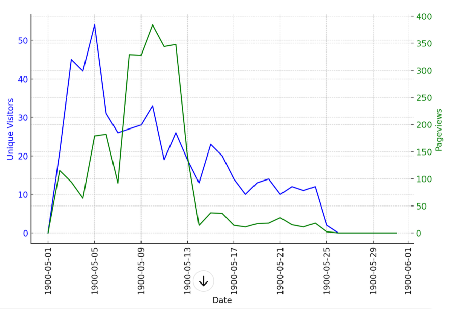
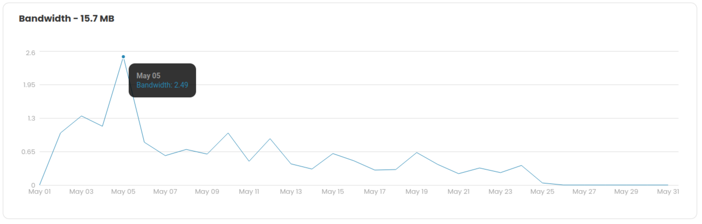

# SiteGround Server Status
1. ## Status in one world
   ### **Very Healthy**
2. ## Summary
    | Resource | Current Usage | Total |Type|
    |-|-|-|-|
    |Disk Free| 2% - 200K | 100% - 10 GB | Acumulative |
    |CPU Usage|  22 segs | 10.000 segs / day | Peek|
    |Program Executions| 350 / Day | 10.000 / Day | Peek|
    |BW| 2.5 / Day | 15.7 / Day | Peek|
    |Unique Visitors (number of distinct individuals requesting pages)| See Graphic Visitor Per Page Below | - | - |
    |Page Views (total number of times all the pages on your website were viewed or refreshed within the same period)| See Graphic Visitor Per Page Below| - | -|

    - A higher number of pageviews relative to unique visitors typically indicates that visitors are interacting with your site more extensively, possibly viewing multiple pages or visiting the site multiple times.    

2. ## Hard Records
   1. **Disk Free**
       
   3. **CPU Usage**
       
   2. **Program Executions**
       
   4. **Visitor Per Page**
       
       Please, understand 1900 as 2024
   5. **BW Usage**
       
    