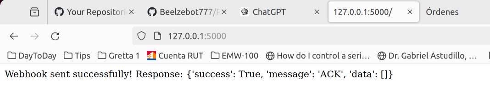

1. # Objective
    - Send the HTTP Request POST in the curl command from an script coded in Flask running on a local laptop into beelzebot/webhook server at SiteGround
        ```
        $ curl -H 'Content-Type: text/plain; charset=utf-8' -d 'BTCUSD Greater Than 9000' -X POST https://beelzebot.com/webhook/
        ```
        Answer:
        ```
        {"success":true,"message":"ACK","data":[]}
        ```
    - The problem detected last Wednesday 8/May was fixed by the SiteGround Ticket 4659241. The ticket is shown below in this document.
1. # Script
    - Bellow code sent an HTTP Request POST to beelzebot.com/webhook
        ```
        from flask import Flask
        import requests

        app = Flask(__name__)

        @app.route('/')
        def send_webhook():
            # URL del webhook
            url = 'https://beelzebot.com/webhook/'

            # Encabezados y datos de la solicitud
            headers = {
                'Content-Type': 'text/plain; charset=utf-8'
            }
            payload = 'BTCUSD Greater Than 9001'

            # Realizar la solicitud POST
            response = requests.post(url, headers=headers, data=payload)

            # Registrar la solicitud y respuesta para depuración
            app.logger.info(f'Request URL: {url}')
            app.logger.info(f'Request Headers: {headers}')
            app.logger.info(f'Request Payload: {payload}')
            app.logger.info(f'Response Status Code: {response.status_code}')
            app.logger.info(f'Response Text: {response.text}')

            # Verificar la respuesta del webhook
            if response.status_code == 200:
                return f'Webhook sent successfully! Response: {response.json()}', 200
            else:
                return f'Failed to send webhook: {response.status_code} - {response.text}', response.status_code

        if __name__ == '__main__':
            app.run(debug=True)

        ```
    - Checking the answer:
        
2. # Issue
    Ticket 4659241
    May 18, 2024 07:07 PM
    beelzebot.com

    Answered

    On behalf of client

    Hola, buenas tardes. I am sending this request from my laptop: ''' curl -H 'Content-Type: text/plain; charset=utf-8' -d 'BTCUSD Greater Than 9000' -X POST https://beelzebot.com/webhook/ ''' After sent it, the answer received is correct. When I send the same request using flask, I receive: 127.0.0.1 - - [18/May/2024 18:26:55] "GET / HTTP/1.1" 403

    Could you please check?

    Aleksandar Dimitrov

    May 18, 2024 07:22 PM
    Hello Rene,

    The **403 response** is related to a **Mod_security rule** being triggered by the request you made as often similar python based requests are used for malicious purposes.

    To assist you in resolving this I excluded this rule for your website.

    If you need additional assistance, feel free to contact us again.

    Best regards,

    Aleksandar Dimitrov
    Senior Technical Support
