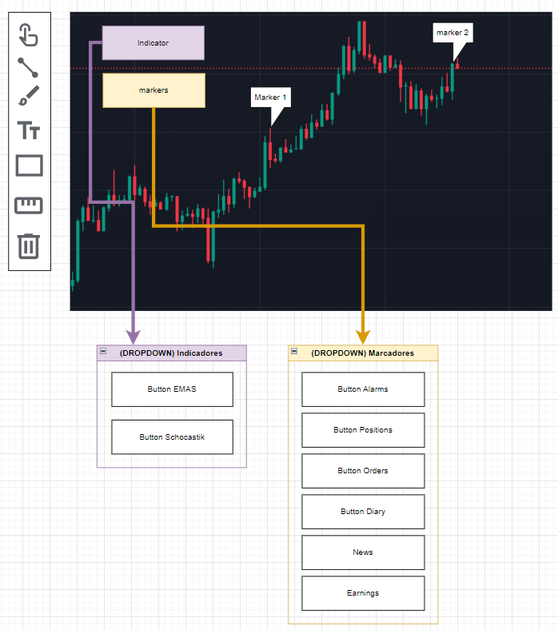

# **Wireframe Design**

## **Purpose**

The purpose of this wireframe is to visually define the structure and layout of the **Charts** component. It aims to serve as a central tool for trading analysis, enabling users to interact with markers, indicators, and various features such as alarms, orders, and diary entries. This design ensures a clear and functional user experience that integrates seamlessly with the rest of the application.

## **Structure**

The **Charts** component is divided into the following key sections:

1. **Main Chart Area:**
   - Displays the candlestick or line chart.
   - Allows interaction with markers representing alarms, orders, positions, diary entries, and more.

2. **Indicators Dropdown:**
   - Contains buttons to toggle technical indicators such as EMAs and Stochastic.

3. **Markers Dropdown:**
   - Includes buttons to toggle visibility for various types of markers:
     - Alarms
     - Positions
     - Orders
     - Diary entries
     - News
     - Earnings

## **Content**

The following elements are included in the wireframe:

1. **Buttons:**
   - **Indicators Dropdown:**
     - Button for EMAs.
     - Button for Stochastic.
   - **Markers Dropdown:**
     - Button for Alarms.
     - Button for Positions.
     - Button for Orders.
     - Button for Diary.
     - Button for News.
     - Button for Earnings.

2. **Interactive Chart:**
   - Candlestick chart displaying trading data.
   - Markers indicating key points such as alarms, orders, and positions.
   - Tooltips for additional marker details.

3. **Drawing Tools:**
   - Options for drawing lines, rectangles, and freehand shapes.
   - Text input for adding annotations.

## **Wireframe**

This wireframe illustrates the layout and interaction flow for the **Charts** component.

- **Main Chart Area:** Center of the application, displaying interactive candlestick data.
- **Dropdowns:** Positioned below the chart for quick access to indicators and markers.

**Diagram Example:**  [Wireframe Image Link](file-8wZd1C65mXNE8ddQWUeKTq)

## **Behavior Flow**

1. **Indicators Interaction:**
   - The user clicks the **Indicators Dropdown** and selects an indicator (e.g., EMA or Stochastic) to toggle its display on the chart.

2. **Markers Interaction:**
   - The user clicks the **Markers Dropdown** and toggles the visibility of specific marker types, such as alarms or diary entries.

3. **Chart Navigation:**
   - The user interacts with markers on the chart to view additional information via tooltips.
   - Users can draw lines, rectangles, or freehand shapes directly on the chart.

4. **Dynamic Updates:**
   - The chart updates in real-time, reflecting any changes in marker visibility, indicators, or trading data.

This wireframe ensures a cohesive and intuitive design, enhancing the usability and functionality of the **Charts** component.

