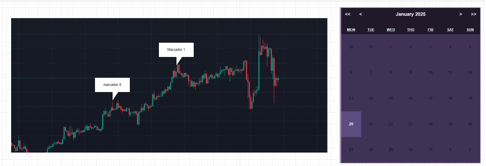
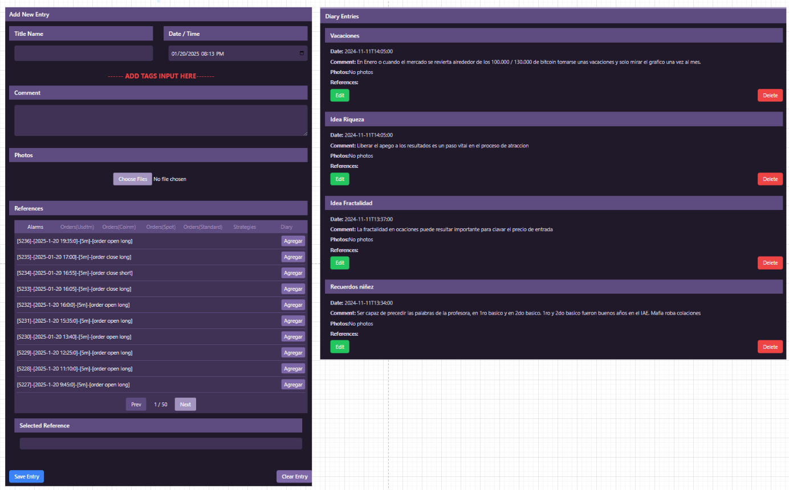

# **Wireframe Design**

## **Purpose**

The wireframe design for the `Diary` component is intended to provide a structured and visual representation of how users can create, manage, and visualize journal entries. This design ensures the component is intuitive and supports essential interactions such as adding new entries, associating them with alarms or trades, and navigating through existing entries.

## **Structure**

### Main Sections

1. **Chart and Calendar Area**:
   - A candlestick chart on the left displays trading data with markers representing journal entries.
   - An interactive calendar on the right allows users to view dates with journal entries, displaying a summary of entries on hover or click.

2. **Entry Management Area**:
   - Located below the chart and calendar, this section allows users to:
     - Add new journal entries with detailed input fields.
     - Associate entries with alarms, orders, positions, and strategies.
     - View, edit, or delete existing entries in a card-based layout.

## **Content**

### Essential Elements

1. **Chart and Calendar Area**
   - Candlestick chart with clickable markers representing journal entries.
   - Interactive calendar showing dates with entries highlighted.
   - Dropdown or pop-up on hover for summarized entry details.

2. **Entry Management Area**
   - Input fields:
     - Title.
     - Date and Time.
     - Text area for comments.
     - File upload for photos or documents.
   - References section:
     - Alarms, orders (various types), positions, strategies, and other diary entries.
   - Buttons for Save, Edit, Delete, and Clear actions.
   - Card-based layout for existing entries, displaying title, date, comments, and references.

## **Wireframe**

(Note: Insert links or attach images here as needed.)

## **Behavior Flow**

1. **User Interaction with the Chart**:
   - Users click on markers to view corresponding journal entries in the management area.
   - Hovering over markers shows a brief summary of the entry.

2. **Navigating the Calendar**:
   - Dates with entries are highlighted.
   - Hovering over a highlighted date displays a dropdown or pop-up with summaries of entries.
   - Clicking on a summary navigates to the full entry in the management area.

3. **Adding a New Entry**:
   - Users fill in the form with details such as title, date, comment, and references.
   - Files can be attached using the upload functionality.
   - Clicking "Save Entry" adds the new entry to the list and updates the calendar and chart.

4. **Editing or Deleting Entries**:
   - Users select an existing entry from the card-based layout.
   - Clicking "Edit" enables modification of the entry details.
   - Clicking "Delete" removes the entry from the system, updating the chart and calendar.

5. **Filtering and Associations**:
   - References section provides a list of alarms, orders, and strategies to associate with the entry.
   - Selecting a reference links it to the entry and updates the relevant components.

