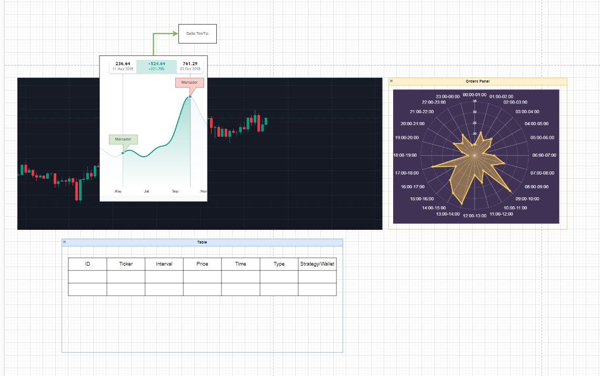

# **Wireframe Design**

## **Purpose**
The wireframe design outlines the structural and visual representation of the component to ensure clarity and alignment with the application's requirements. Its primary role is to guide the development of an intuitive and functional user interface for displaying and analyzing executed orders on BingX.

## **Structure**

### **Main Sections**
1. **Main Chart Area**
   - **Description**: Displays executed orders using markers and a "Delta tooltip" for profit/loss analysis.
   - **Layout**: Central area of the UI.
   - **Key Elements**:
     - Candlestick chart.
     - Markers for executed orders.
     - Delta tooltip for profit/loss visualization.

2. **Orders Panel (Radar-Chart)**
   - **Description**: Displays the hourly distribution of orders.
   - **Layout**: Positioned on the right side of the chart.
   - **Key Elements**:
     - Radar-Chart with hour-based distribution of orders.

3. **Orders Table**
   - **Description**: Provides a tabular representation of orders with sorting and filtering options.
   - **Layout**: Located at the bottom of the UI.
   - **Key Elements**:
     - Columns: ID, Ticker, Interval, Price, Time, Type, Strategy/Wallet.
     - Pagination and filter options.

4. **Navigation Bar (Optional)**
   - **Description**: Enables quick access to the component from other parts of the application.
   - **Key Elements**:
     - Navigation link to "Orders."

## **Content**

### **Essential Elements**
1. **Main Chart Area**
   - Candlestick chart.
   - Markers to visualize order points.
   - Delta tooltip to indicate profit/loss.

2. **Orders Panel**
   - Radar-Chart with hour-based order data.

3. **Orders Table**
   - Detailed order data with the following columns:
     - ID
     - Ticker
     - Interval
     - Price
     - Time
     - Type
     - Strategy/Wallet
   - Filtering options for intervals, order types, strategies, and tickers.

## **Wireframe**

### **Main Layout**
- Central section: Candlestick chart with markers and Delta tooltip.
- Right panel: Radar-Chart for order distribution.
- Bottom section: Table with detailed order data.

### **Visual Representation**
The visual layout includes:
1. **Main Chart**: Centered with markers and tooltips.
2. **Radar-Chart**: Positioned to the right.
3. **Table**: Spanning the bottom with sortable columns and filters.

## **Behavior Flow**

### **User Journey**
1. **Interacting with Markers**:
   - Hovering over a marker displays the Delta tooltip with profit/loss details.
   - Clicking a marker highlights the corresponding row in the table.

2. **Filtering Data**:
   - Users apply filters on the table to narrow down results by intervals, order types, strategies, or tickers.
   - The filtered data dynamically updates the table and charts.

3. **Radar-Chart Interaction**:
   - Users can hover over sections of the Radar-Chart to view detailed hourly distribution metrics.

4. **Pagination**:
   - Users navigate through the table using pagination controls.

---
