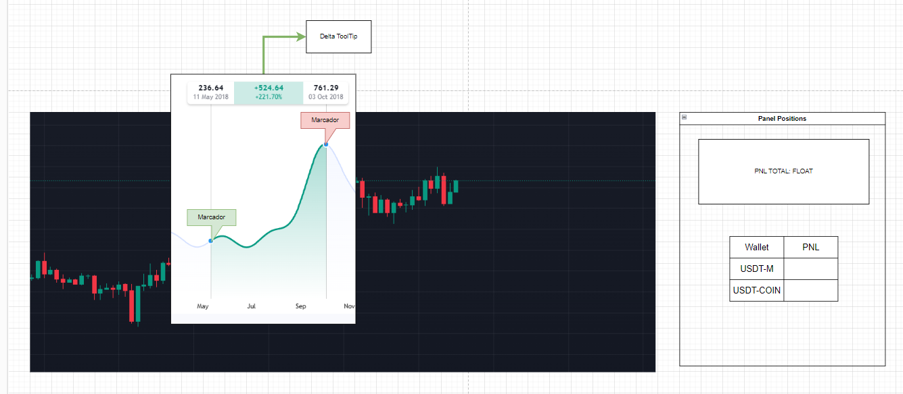
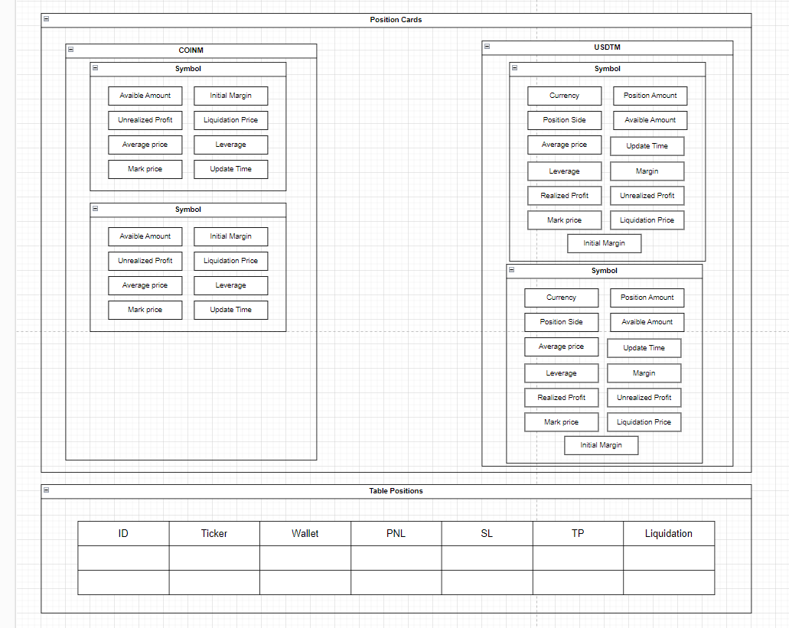

# **Wireframe Design**

## **Purpose**
The purpose of this wireframe is to outline the visual and functional design of the "Positions" component. It serves as a comprehensive interface for managing and viewing open trading positions across different wallets and subaccounts. This component will allow users to stop operations, set Stop Loss (SL) and Take Profit (TP), and review essential metrics such as PNL (Profit and Loss) in both graphical and tabular formats.

## **Structure**

### Main Sections:

1. **Charts with Delta Tooltips**:
   - Positioned at the top, this area displays trading positions as markers directly on the chart. The tooltips provide detailed information, such as PNL, entry price, and symbol.

2. **Position Cards**:
   - Located below the chart, cards represent detailed information for each active position. Key attributes include symbol, position size, margin, leverage, and PNL.
   - Includes actionable buttons to stop operations or set SL/TP.

3. **Positions Panel**:
   - Located on the right side of the interface, this panel summarizes the total PNL and provides an overview of wallet-level metrics.

4. **Positions Table**:
   - Below the cards, a table presents detailed information about all open positions in a structured format. The table supports actions such as stopping operations or setting SL/TP directly.

## **Content**

### Essential Elements:

1. **Buttons**:
   - Stop Operation.
   - Set SL and TP.

2. **Inputs**:
   - SL and TP configuration fields.

3. **Charts**:
   - Lightweight chart integration with position markers and Delta tooltips.

4. **Panels**:
   - Positions summary showing aggregated PNL.

5. **Tables**:
   - ID, Ticker, Wallet, PNL, SL, TP, Liquidation Price.

6. **Cards**:
   - Detailed position information for USDT-M and COIN-M wallets.

## **Wireframe**

### Attached Wireframe
[Reference Image: Wireframe Positions Component]

## **Behavior Flow**

### User Journey:
1. **Viewing Positions on the Chart**:
   - Users can hover over position markers to see details in the Delta tooltips.
   - Clicking on markers highlights the corresponding position in the cards and table.

2. **Managing Positions from Cards**:
   - Users can stop operations or set SL/TP directly from the position cards.

3. **Using the Positions Table**:
   - Users can sort and filter positions in the table.
   - Actions such as stopping operations and configuring SL/TP can also be performed here.

4. **Monitoring Metrics in the Positions Panel**:
   - Users can review aggregated metrics, such as total PNL across wallets, in the side panel.

