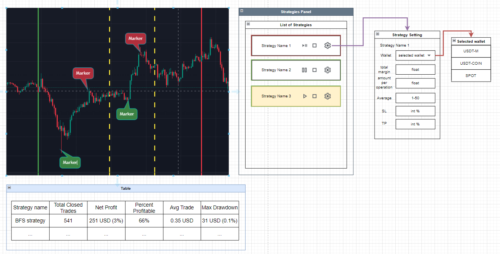

# **Wireframe Design**

## **Purpose**
The purpose of the Strategies component's design is to provide a user-friendly interface for managing trading strategies, including activating, pausing, stopping, and configuring them. It also aims to seamlessly integrate with alarms and charts to display real-time performance, operations, and statistics.

## **Structure**

### **Main Sections**
1. **Strategies Panel**
   - Displays a list of strategies with controls for activation, pausing, and stopping.
   - Each strategy includes settings accessible via a gear icon.

2. **Strategy Settings**
   - Allows configuration of wallets, margin amounts, stop loss (SL), and take profit (TP).
   - Includes options for selecting wallet types (e.g., USDT-M, USDT-Coin, Spot).

3. **Charts Integration**
   - Visual markers on the chart indicating strategy activation and deactivation.
   - Displays operations executed by the strategy directly on the chart.

4. **Statistics Table**
   - Summarizes strategy performance metrics, including:
     - Total closed trades.
     - Net profit (percentage).
     - Percent profitable.
     - Average trade value.
     - Maximum drawdown.

## **Content**

### **Essential Elements**

#### **Strategies Panel**
- List of strategies.
- Controls:
  - Play (Activate strategy).
  - Pause.
  - Stop.
- Gear icon for opening detailed settings.

#### **Strategy Settings**
- Inputs:
  - Wallet selection dropdown.
  - Total margin amount per operation (float input).
  - Average trade count (range input).
  - Stop loss (SL) percentage (int input).
  - Take profit (TP) percentage (int input).

#### **Charts Integration**
- Visual markers:
  - Green vertical line for strategy activation.
  - Red vertical line for strategy deactivation.
  - Operations displayed as labeled markers.

#### **Statistics Table**
- Columns:
  - Strategy Name.
  - Total Closed Trades.
  - Net Profit.
  - Percent Profitable.
  - Average Trade.
  - Max Drawdown.

## **Wireframe**

### **Mockup Overview**
- The wireframe depicts:
  - A vertical panel on the right-hand side for the Strategies Panel.
  - A modal interface for Strategy Settings.
  - The chart area with visual markers and a statistics table below.

### **Attached Wireframe**
- Refer to the attached image for detailed layout.

## **Behavior Flow**

### **User Journey**
1. **Strategy Management**:
   - Users view the list of strategies in the Strategies Panel.
   - Activate a strategy by clicking the play icon.
   - Adjust strategy parameters via the gear icon, opening the Strategy Settings modal.

2. **Chart Integration**:
   - Upon activating a strategy, a green vertical line is drawn on the chart.
   - When the strategy is stopped or paused, a red vertical line is added.
   - Operations related to the strategy are displayed as labeled markers on the chart.

3. **Statistics Viewing**:
   - Users scroll to the statistics table below the chart to view real-time performance metrics.

---

