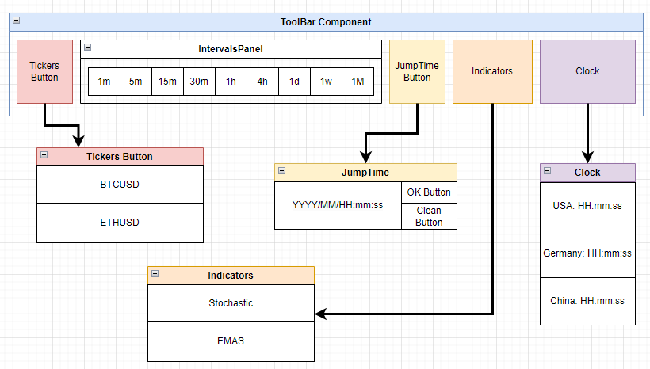

# **Wireframe Design**

## **Purpose**
The purpose of the `ToolBar` wireframe is to provide a clear and organized interface that allows users to interact with the chart component (`Charts`). This toolbar centralizes key functionalities such as selecting a ticker, adjusting time intervals, adding indicators, jumping to specific timestamps, and displaying market-related clocks. Its goal is to optimize user interaction while maintaining a compact and functional layout.

---

## **Structure**
The `ToolBar` component is divided into the following main sections:
1. **Tickers Button**:
   - Dropdown to select financial tickers (e.g., `BTCUSD`, `ETHUSD`).
2. **Intervals Panel**:
   - Buttons to switch between time intervals (`1m`, `5m`, `15m`, `30m`, `1h`, `4h`, `1d`, `1w`, `1M`).
3. **JumpTime Button**:
   - Dropdown with an input field for selecting a specific date and time.
   - Includes action buttons: `OK Button` and `Clean Button`.
4. **Indicators**:
   - Dropdown to add/remove indicators like `Stochastic` and `EMAs`.
5. **Clock**:
   - Dropdown displaying the current time and key trading hours for major markets:
     - USA: `HH:mm:ss`
     - Germany: `HH:mm:ss`
     - China: `HH:mm:ss`

---

## **Content**
### Essential Elements:
1. **Buttons**:
   - Tickers Dropdown Button.
   - Time Intervals Buttons.
   - JumpTime Dropdown with `OK` and `Clean` buttons.
   - Indicators Dropdown Button.
   - Clock Dropdown Button.
2. **Input**:
   - Input field for selecting date and time in the `JumpTime` section.
3. **Dropdown Clocks**:
   - Current time and trading hours for:
     - USA: `HH:mm:ss`
     - Germany: `HH:mm:ss`
     - China: `HH:mm:ss`

### Additional Features:
- Compact and space-efficient design.
- Dropdown menus for detailed selections (Tickers, Indicators, JumpTime, Clock).

---

## **Wireframe**
### Attached Diagram:

---

## **Behavior Flow**
### User Journey:
1. **Tickers Button**:
   - User clicks the dropdown to select a ticker (e.g., `BTCUSD` or `ETHUSD`).
   - The chart updates based on the selected ticker.
2. **Intervals Panel**:
   - User selects a time interval button (e.g., `5m`, `1h`).
   - The chart adjusts to display data for the selected interval.
3. **JumpTime**:
   - User opens the dropdown, enters a date and time, and clicks `OK`.
   - The chart scrolls to the selected timestamp.
   - If the `Clean Button` is clicked, the input resets.
4. **Indicators**:
   - User opens the dropdown and selects an indicator (e.g., `Stochastic` or `EMAs`).
   - The selected indicator is added to the chart.
5. **Clock**:
   - User opens the dropdown to view the current time and trading hours for major markets.
   - The dropdown displays real-time updates for:
     - USA: `HH:mm:ss`
     - Germany: `HH:mm:ss`
     - China: `HH:mm:ss`.

---

This updated design ensures that all functionalities, including the `Clock` dropdown, are organized and easily accessible. Let me know if further adjustments are needed!
# **Wireframe Design**

## **Purpose**
The purpose of the `ToolBar` wireframe is to provide a clear and organized interface that allows users to interact with the chart component (`Charts`). This toolbar centralizes key functionalities such as selecting a ticker, adjusting time intervals, adding indicators, jumping to specific timestamps, and displaying market-related clocks. Its goal is to optimize user interaction while maintaining a compact and functional layout.

---

## **Structure**
The `ToolBar` component is divided into the following main sections:
1. **Tickers Button**:
   - Dropdown to select financial tickers (e.g., `BTCUSD`, `ETHUSD`).
2. **Intervals Panel**:
   - Buttons to switch between time intervals (`1m`, `5m`, `15m`, `30m`, `1h`, `4h`, `1d`, `1w`, `1M`).
3. **JumpTime Button**:
   - Dropdown with an input field for selecting a specific date and time.
   - Includes action buttons: `OK Button` and `Clean Button`.
4. **Indicators**:
   - Dropdown to add/remove indicators like `Stochastic` and `EMAs`.
5. **Clock**:
   - Dropdown displaying the current time and key trading hours for major markets:
     - USA: `HH:mm:ss`
     - Germany: `HH:mm:ss`
     - China: `HH:mm:ss`

---

## **Content**
### Essential Elements:
1. **Buttons**:
   - Tickers Dropdown Button.
   - Time Intervals Buttons.
   - JumpTime Dropdown with `OK` and `Clean` buttons.
   - Indicators Dropdown Button.
   - Clock Dropdown Button.
2. **Input**:
   - Input field for selecting date and time in the `JumpTime` section.
3. **Dropdown Clocks**:
   - Current time and trading hours for:
     - USA: `HH:mm:ss`
     - Germany: `HH:mm:ss`
     - China: `HH:mm:ss`

### Additional Features:
- Compact and space-efficient design.
- Dropdown menus for detailed selections (Tickers, Indicators, JumpTime, Clock).

---

## **Wireframe**
### Attached Diagram:

---

## **Behavior Flow**
### User Journey:
1. **Tickers Button**:
   - User clicks the dropdown to select a ticker (e.g., `BTCUSD` or `ETHUSD`).
   - The chart updates based on the selected ticker.
2. **Intervals Panel**:
   - User selects a time interval button (e.g., `5m`, `1h`).
   - The chart adjusts to display data for the selected interval.
3. **JumpTime**:
   - User opens the dropdown, enters a date and time, and clicks `OK`.
   - The chart scrolls to the selected timestamp.
   - If the `Clean Button` is clicked, the input resets.
4. **Indicators**:
   - User opens the dropdown and selects an indicator (e.g., `Stochastic` or `EMAs`).
   - The selected indicator is added to the chart.
5. **Clock**:
   - User opens the dropdown to view the current time and trading hours for major markets.
   - The dropdown displays real-time updates for:
     - USA: `HH:mm:ss`
     - Germany: `HH:mm:ss`
     - China: `HH:mm:ss`.

---

This updated design ensures that all functionalities, including the `Clock` dropdown, are organized and easily accessible. Let me know if further adjustments are needed!
